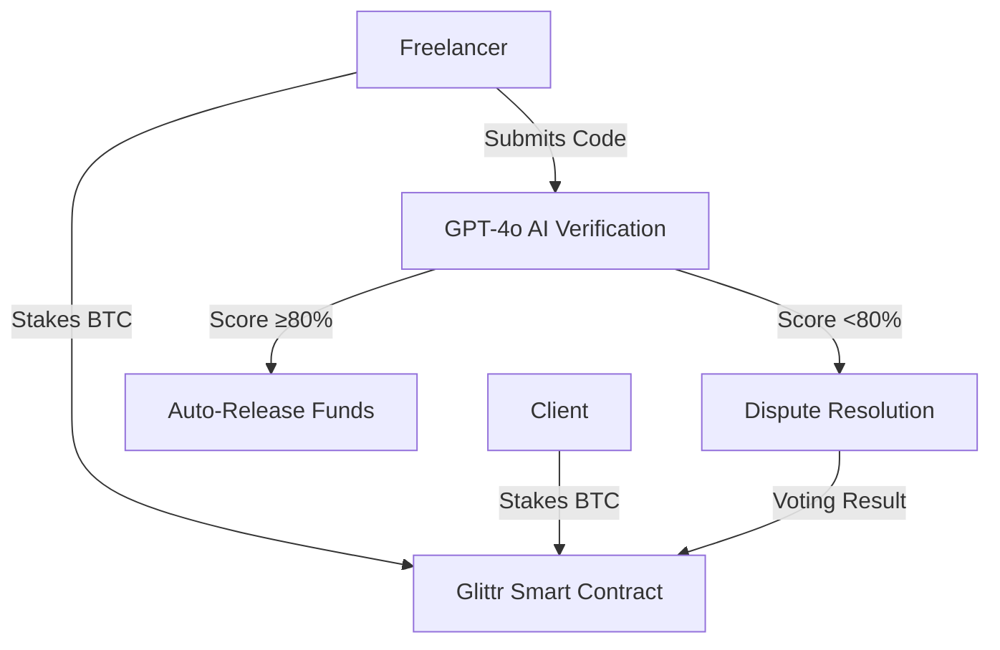

# Glittr Escrow Smart Contract

This is a smart contract implementation for Glittr that handles escrow between a client and a freelancer with automated verification using GPT-4o.

## How It Works

The contract follows this workflow:



### Flow Description

1. **Contract Creation**: Client creates a job with requirements and funds.
2. **Staking**: Both the client and freelancer stake BTC into the contract.
3. **Code Submission**: Freelancer submits completed code.
4. **AI Verification**: GPT-4o verifies the code against the requirements.
5. **Auto-Release**: If code passes verification (score ≥80%), funds are automatically released to the freelancer.
6. **Dispute Resolution**: If code fails verification, the contract enters dispute resolution.
7. **Voting**: An arbitrator can review evidence and vote to release funds or return them to the client.

## Implementation Details

The contract is implemented as a Mint Only Asset (MOA) on Glittr with these components:

- **Contract Creation**: Uses preallocated mechanism with both client and freelancer public keys
- **Funding**: Stakes funds from client and freelancer
- **Verification**: Uses GPT-4o with JSON schema validation to ensure consistent code verification
- **Fund Release**: Automatically releases funds or handles disputes based on verification results
- **Dispute Resolution**: Implements a voting mechanism for fair dispute resolution

## GPT Verification

The contract uses GPT-4o to verify code submissions, with these key features:

- **Schema Validation**: Uses OpenAI's JSON schema validation to ensure consistent results
- **Comprehensive Analysis**: Evaluates code quality, correctness, and security
- **Transparent Scoring**: Provides detailed feedback on strengths and issues
- **On-chain Metadata**: Stores verification results as metadata in the transaction

## Usage

See `escrow-example.ts` for a complete example of how to use the contract. Here's a basic overview:

```typescript
// Initialize SDK
const client = new GlittrSDK({
  /* config */
});

// Create escrow service
const escrowService = new EscrowService(client);

// Create a new job
const { jobId } = await escrowService.createJob({
  clientPrivateKey: "...",
  freelancerPublicKey: "...",
  requirements: "...",
  amount: "1000000", // in sats
});

// Submit code for verification
const result = await escrowService.submitCode({
  jobId,
  code: "...",
  freelancerPrivateKey: "...",
});

// Check verification results
console.log(result.details.score); // 0-100
console.log(result.details.status); // 'pass' or 'fail'
console.log(result.details.issues); // Array of issues found
console.log(result.details.strengths); // Array of code strengths

// If needed, resolve disputes
if (!result.passed) {
  await escrowService.resolveDispute({
    jobId,
    voterPrivateKey: "...",
    resolution: "approve", // or 'reject'
    evidence: "...",
  });
}
```

## Security Considerations

- **Timelocks**: Prevents indefinite fund locking
- **Authorized Access**: Only authorized parties can interact with the contract
- **Transparent Verification**: Results stored on-chain for transparency
- **Dispute Resolution**: Fair mechanism for handling failed verifications
- **Schema Validation**: Ensures consistent and predictable verification results

## Future Improvements

- Multi-signature requirements for larger value contracts
- Reputation system for freelancers and clients
- Milestone-based payment releases
- Fee mechanisms for platform sustainability
- Integration with more specialized code analysis models
